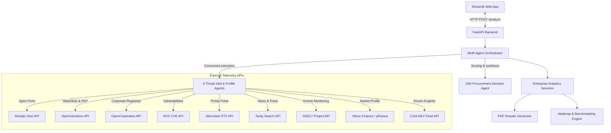

# 🛡️ RiskIntel: Enterprise Vendor Risk Platform

RiskIntel is a multi-agent vendor intelligence and risk assessment platform designed to automate third-party vendor due diligence. The system aggregates real-time corporate telemetry across cybersecurity, financial, compliance, legal, geopolitical, and reputational risk vectors. By executing independent scanning agents concurrently, the platform synthesizes complex risk parameters into actionable procurement recommendations and executive reports.

---

## 📌 Project Architecture

The application is built on a split architecture consisting of a Python FastAPI backend and a Streamlit-based web dashboard.



* **Frontend (`/streamlit_app`):** An interactive dashboard styled with a premium dark-mode theme inspired by Palantir/Bloomberg security operations consoles. Provides real-time interactive charts, tabular comparisons, live feed data, and PDF reports.
* **Backend (`/backend`):** A high-performance FastAPI server running an asynchronous multi-agent orchestrator. The orchestrator triggers all intelligence agents in parallel threads to prevent network bottlenecks.

---

## 🤖 Multi-Agent & API Directory

RiskIntel utilizes 10 distinct AI and heuristic agents. Each agent relies on target external APIs to construct its risk dossier:

| Agent Name | Risk Category | Target External APIs & Libraries | Description |
| :--- | :--- | :--- | :--- |
| **Cybersecurity Agent** | Cybersecurity | Shodan, AlienVault OTX, NVD, Tavily Search, Gemini/OpenAI | Scans active exposed services, open ports, historical data breaches, and active CVEs. |
| **Financial Agent** | Financial Risk | yfinance (Yahoo Finance API), Gemini/OpenAI | Evaluates market capitalization, profit margins, current liquidity ratio, and leverage stability. |
| **ESG Agent** | ESG Risk | Tavily Search API, Gemini/OpenAI | Monitors environmental violations, labor disputes, carbon footprint, and governance controversies. |
| **Geopolitical Agent** | Geopolitical & Supply Chain | GDELT Event Feed API, Tavily Search, Gemini/OpenAI | Tracks regional logistics delays, shipping bottlenecks, import/export tariffs, and geopolitical conflicts. |
| **Legal & Sanctions Agent** | Legal & Sanctions | OpenSanctions API, Tavily Search, Gemini/OpenAI | Performs watchlist checks against OFAC/UN lists, PEP records, and litigation history. |
| **Compliance Agent** | Compliance Risk | Tavily Search API, Gemini/OpenAI | Validates presence of SOC 2, ISO 27001, HIPAA, GDPR alignment, or compliance fines. |


---

## ⚡ Core Systems & Intelligence Engine

### 1. The Multi-Agent Orchestrator
The backend orchestrator executes the 9 threat vectors concurrently using Python's `asyncio.gather()`. This parallel fetching mechanism reduces the overall analysis latency from minutes to seconds.

### 2. The Dynamic Scoring System
Risk scores are calculated dynamically by a hybrid scoring engine. It starts with base risk metrics compiled from API findings and scales them according to critical threat keywords. To guarantee realistic, unique profiles for different vendors, a deterministic cryptographic hash offset (MD5 of corporate name + category) is applied.

### 3. LLM Router & Fallback Chain
Factual summaries and reports are handled by a multi-layered LLM connector (`llm_service.py`):
1. **Factual Heuristics Routing:** To minimize API roundtrips and prevent network latency, individual agent reports are instantly synthesized using an inline heuristic text-generation engine.
2. **Gemini API:** Generates executive summaries, roadmaps, and final decisions using `gemini-1.5-flash`.
3. **OpenAI API:** Graceful secondary fallback using `gpt-4o-mini` if Gemini is unavailable.
4. **Local Ollama:** Tertiary fallback using local LLM models (e.g. `qwen2`, `phi`, `gemma3`, `llama3`).
5. **Heuristics Fallback:** Serves as a full-offline fallback to guarantee 100% service availability.

---

## ⚙️ Configuration & Environment Variables

Create a `.env` file inside the `/backend` folder with the following structure:

```env
# SHODAN
SHODAN_API_KEY=your_shodan_key_here

# ALIENVAULT
OTX_API_KEY=your_alienvault_key_here

# SEARCH & THREAT INTELLIGENCE
TAVILY_API_KEY=your_tavily_key_here
NVD_API_KEY=your_nvd_key_here

# GENERATIVE AI (LLMs)
GEMINI_API_KEY=your_gemini_key_here
OPENAI_API_KEY=your_openai_key_here

# APP SETTINGS
APP_ENV=development
LOG_LEVEL=INFO
```

---

## 🚀 Setup & Execution Guide

### Prerequisites
* Python 3.10+ installed
* Internet connection (for telemetry APIs)

### 1. Backend Server Setup
From the root directory, navigate to the `backend` folder:
```powershell
cd backend
```

Activate the virtual environment:
* **Windows (PowerShell):**
  ```powershell
  .\venv\Scripts\Activate.ps1
  ```
* **macOS/Linux:**
  ```bash
  source venv/bin/activate
  ```

Run the backend FastAPI server:
```bash
python -m uvicorn main:app --host 127.0.0.1 --port 8000 --reload
```
Verify the server is running by opening [http://127.0.0.1:8000/](http://127.0.0.1:8000/) in your browser.

### 2. Frontend Streamlit Dashboard Setup
Open a separate terminal window and navigate to the `streamlit_app` folder:
```powershell
cd streamlit_app
```

Run the Streamlit application:
```bash
..\backend\venv\Scripts\streamlit run app.py
```

The application dashboard will automatically open in your browser at **[http://localhost:8501](http://localhost:8501)**.
